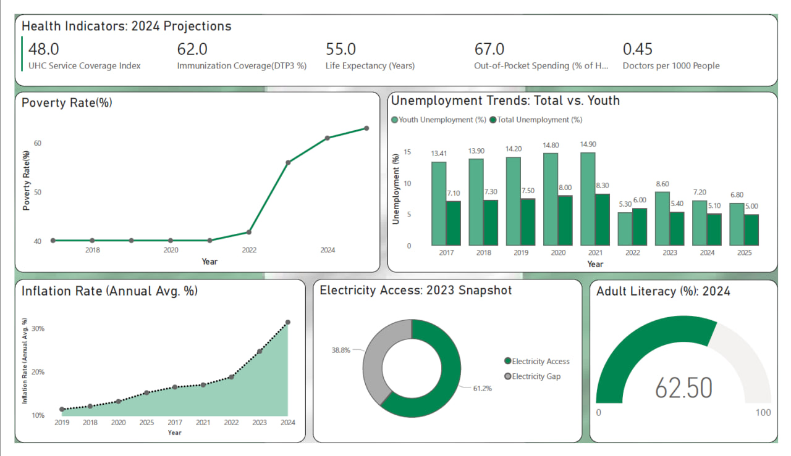

# Nigeria-SocioEconomic-Analysis
Evaluating the Impact of Nigeria’s Structural Economy on Human Development (2017–2025)

Summary

This project evaluates the structural health of the Nigerian economy and the effects of recent macroeconomic gains on the average Nigerian. 
The dashboard analyzes the intersection of human capital, infrastructure, and macro-economic stability.

Project Workflow

Step 1: Data Acquisition: Sourced multi-sectoral data from the NBS (Labor), CBN (Inflation), and the World Bank (Health/Infrastructure) to create a holistic view of the Nigerian economy.

Step 2: Data Cleaning & Transformation (Power Query): Standardized date formats across different datasets, integrated disparate datasets

Step 3: Modeling & DAX: Developed custom DAX measures to handle complex socio-economic trends and ensure the visuals remained dynamic

Step 4: Visualization: Applied a customized Nigeria-centric palette (#008751 for Green, #605E5C for medium-dark Grey ) and the Nigerian flag as a background to align with professional policy-briefing standards. 

Key Insights

•	The huge dip in the unemployment rates (2022), resulted from a change in the unemployment measurement method by NBS to match the new global ILO guidelines. After 2023, the numbers show a continuous downward trend in both Youth and Total Unemployment.

•	The 38.8% electricity gap represents about 86 million Nigerians without access to power and even the 62.2% of those with electricity access, do not enjoy stable and consistent electricity supply.

•	The data shows that ~ 63% of our adults are literate, yet the majority remain in the informal sector, showing that literacy alone is not sufficient to create a productive and industrialized economy.

•	The UHC index of 48 shows and 0.45 doctor to patient ratio shows that even if people are educated, they are physically vulnerable, which will affect overall productivity

•	The Inflation and poverty rate in Nigeria has a highly positive relation(causality). With increasing prices, the volume of goods an amount of money can buy is consistently reducing

Data Sources

Labour, Inflation & Poverty Statistics: National Bureau of Statistics (NBS) Nigeria.

Electricity Access and Literacy Rates: World Bank Open Data.

Health Indicators: World Health Organization (WHO) Global Health Observatory.

